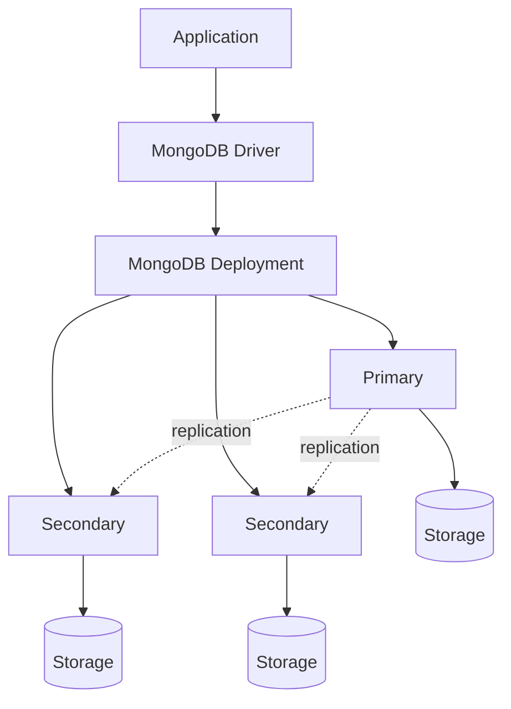
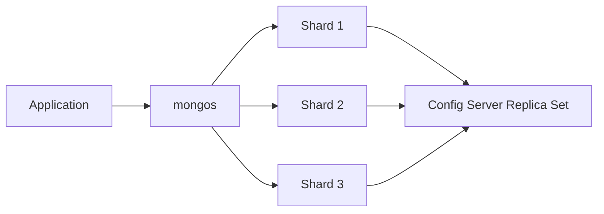
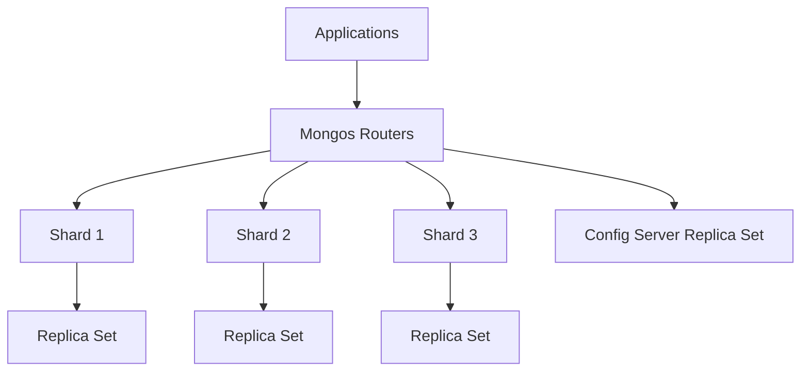

# MongoDB Database - NoSQL

# MongoDB --- From Fundamentals to Advanced Distributed Systems

```{=html}
<p align="center">
```

``{=html}

```{=html}
</p>
```

```{=html}
<p align="center">
```

`<strong>`{=html}A structured, research-oriented roadmap for learning
MongoDB from zero to production-grade distributed database
engineering.`</strong>`{=html}

```{=html}
</p>
```

```{=html}
<p align="center">
```

`<a href="https://www.mongodb.com/docs/">`{=html}``{=html}`</a>`{=html}
`<a href="https://www.mongodb.com/docs/manual/">`{=html}``{=html}`</a>`{=html}
`<a href="https://www.mongodb.com/docs/atlas/">`{=html}``{=html}`</a>`{=html}
``{=html}
``{=html}
``{=html}
``{=html}

```{=html}
</p>
```

---

# 👨‍💻 About Me

Hi, I'm **Satinder Singh Sall**, a Full-Stack Developer, AI Enthusiast, and MCA student passionate about building scalable digital products, intelligent software systems, and meaningful user experiences.

My journey spans across **Web Development, Mobile Applications, Artificial Intelligence, Cloud Technologies, and Creative Writing**. I enjoy transforming ideas into production-ready solutions using modern technologies while continuously exploring emerging fields like Machine Learning, Computer Vision, and Automation.

Currently, I'm pursuing my **Master of Computer Applications (MCA)** while actively developing full-stack applications, AI-powered solutions, and open-source learning resources. My work focuses on creating software that is not only functional but also scalable, maintainable, and impactful.

## 🚀 What I'm Building

- 🤖 AI-Powered Attendance System using Face Recognition & Voice Biometrics
- 🌐 Modern Full-Stack Web Applications
- 📱 Cross-Platform Mobile Applications
- 🎮 Exploring Game Development & Interactive Experiences
- 📚 Open-Source Learning Roadmaps and Technical Resources
- ✍️ Satinder Poetry — A platform for original poetry, essays, and creative writing

## 🛠️ Core Technologies

**Frontend:** React, Next.js, TypeScript, Tailwind CSS
**Backend:** Node.js, Express.js, REST APIs
**Databases:** MongoDB, PostgreSQL, MySQL, Firebase, Supabase
**DevOps & Cloud:** Docker, GitHub Actions, Vercel, Render
**Programming:** Python, Java, JavaScript, C++, C#, Kotlin
**AI / ML:** Python, Computer Vision, Face Recognition, Automation
**Mobile Apps:** High-Performance Android, iOS, Cross-Platform & Native Development

## 🌍 Connect With Me

🌐 Portfolio: https://satinder-portfolio.vercel.app

💻 GitHub: https://github.com/SatinderSinghSall

💼 LinkedIn: https://www.linkedin.com/in/satinder-singh-sall-b62049204/

🎥 YouTube: https://www.youtube.com/@satindersinghsall.3841

✍️ Satinder Poetry: https://satinderpoetry.com

🤖 AI Attendance Project: https://ai-attendance-app-satinder.vercel.app/

---

> _"I believe great software is built at the intersection of engineering excellence, continuous learning, creativity, and real-world problem solving."_

⭐ Always learning. Always building. Always improving.

---

## Abstract

MongoDB is a document-oriented database designed around flexible BSON
documents, expressive queries, indexes, aggregation, replication, and
horizontal scaling.

This repository is designed as a **complete MongoDB study guide and
laboratory curriculum**. It intentionally moves beyond CRUD syntax. The
objective is to develop the ability to:

- understand MongoDB's data model and execution model;
- design schemas for real workloads;
- write correct and expressive queries;
- build efficient indexes;
- construct aggregation pipelines;
- reason about consistency, transactions, and failure;
- understand replica sets and sharded clusters;
- diagnose performance problems;
- secure and operate MongoDB in production; and
- make evidence-based database design decisions.

> **Learning philosophy:** Learn the model → write queries → model real
> data → measure performance → study failure modes → design for
> production.

---

## Table of Contents

- [1. Learning Outcomes](#1-learning-outcomes)
- [2. Prerequisites](#2-prerequisites)
- [3. MongoDB at a Glance](#3-mongodb-at-a-glance)
- [4. SQL vs MongoDB Mental Model](#4-sql-vs-mongodb-mental-model)
- [5. MongoDB Architecture](#5-mongodb-architecture)
- [6. Complete Learning Roadmap](#6-complete-learning-roadmap)
  - [Phase I --- Foundations](#phase-i--foundations)
  - [Phase II --- CRUD and Query
    Language](#phase-ii--crud-and-query-language)
  - [Phase III --- Data Modeling](#phase-iii--data-modeling)
  - [Phase IV --- Indexing and Query
    Performance](#phase-iv--indexing-and-query-performance)
  - [Phase V --- Aggregation](#phase-v--aggregation)
  - [Phase VI --- Application
    Development](#phase-vi--application-development)
  - [Phase VII --- Transactions and
    Consistency](#phase-vii--transactions-and-consistency)
  - [Phase VIII --- Replication and High
    Availability](#phase-viii--replication-and-high-availability)
  - [Phase IX --- Sharding and Distributed
    Systems](#phase-ix--sharding-and-distributed-systems)
  - [Phase X --- Security](#phase-x--security)
  - [Phase XI --- Operations and
    Production](#phase-xi--operations-and-production)
  - [Phase XII --- Advanced Engineering and
    Research](#phase-xii--advanced-engineering-and-research)
- [7. Core Concepts](#7-core-concepts)
- [8. BSON and Data Types](#8-bson-and-data-types)
- [9. CRUD Reference](#9-crud-reference)
- [10. Query Operators](#10-query-operators)
- [11. Updates and Atomicity](#11-updates-and-atomicity)
- [12. Data Modeling](#12-data-modeling)
- [13. Indexing](#13-indexing)
- [14. Aggregation Framework](#14-aggregation-framework)
- [15. Transactions and Consistency](#15-transactions-and-consistency)
- [16. Replication](#16-replication)
- [17. Sharding](#17-sharding)
- [18. Security](#18-security)
- [19. Performance Engineering](#19-performance-engineering)
- [20. Observability and Operations](#20-observability-and-operations)
- [21. Testing Strategy](#21-testing-strategy)
- [22. Project-Based Curriculum](#22-project-based-curriculum)
- [23. Research Questions](#23-research-questions)
- [24. Recommended Study Method](#24-recommended-study-method)
- [25. Cheat Sheets](#25-cheat-sheets)
- [26. Common Mistakes](#26-common-mistakes)
- [27. Glossary](#27-glossary)
- [28. References](#28-references)
- [29. Suggested Repository
  Structure](#29-suggested-repository-structure)
- [30. Progress Tracker](#30-progress-tracker)

---

# 1. Learning Outcomes

After completing this curriculum, a learner should be able to:

### Knowledge

- Explain the document model and BSON.
- Distinguish databases, collections, documents, fields, indexes, and
  namespaces.
- Explain embedding versus referencing.
- Describe MongoDB's storage, query, replication, and sharding
  concepts.
- Explain consistency, durability, isolation, and availability
  trade-offs.

### Practical skills

- Install and operate MongoDB locally.
- Work with `mongosh`, MongoDB Compass, and MongoDB Atlas.
- Perform CRUD operations.
- Write complex queries.
- Model nested and relational-looking data.
- Design compound, multikey, partial, sparse, unique, TTL, and text
  indexes where appropriate.
- Build aggregation pipelines.
- Use `explain()` to investigate query plans.
- Implement transactions.
- Develop applications using an official MongoDB driver.
- Configure authentication and authorization.
- Diagnose common production issues.

### Engineering skills

- Translate application access patterns into schema designs.
- Benchmark alternatives instead of relying on intuition.
- Identify indexing trade-offs.
- Reason about replication and failover.
- Design shard keys using workload characteristics.
- Plan capacity, observability, backup, recovery, and incident
  response.

---

# 2. Prerequisites

Recommended prerequisites:

---

Area Expected knowledge

---

Programming Basic programming in JavaScript,
Python, Java, Go, C#, or another
language

Data structures Arrays, objects/maps, trees, basic
complexity

Networking Basic client/server and TCP/IP
concepts

Operating systems Processes, files, memory, CPU,
basic Linux

Databases Helpful but not required

SQL Helpful for comparison, not
mandatory

---

If you are completely new to databases, start with the conceptual
sections before writing queries.

---

# 3. MongoDB at a Glance

MongoDB stores records as BSON documents.

```text
MongoDB Deployment
│
├── Database
│   ├── Collection
│   │   ├── Document
│   │   ├── Document
│   │   └── Document
│   │
│   └── Collection
│
└── Database
```

A document can contain nested objects and arrays:

```javascript
{
  _id: ObjectId("..."),
  name: "Ada Lovelace",
  profile: {
    country: "United Kingdom",
    interests: ["mathematics", "computing"]
  },
  skills: [
    { name: "mathematics", level: 5 },
    { name: "programming", level: 4 }
  ]
}
```

MongoDB's document model is particularly useful when the way data is
read by an application can be represented naturally as a document.

---

# 4. SQL vs MongoDB Mental Model

Relational concept MongoDB concept

---

Database Database
Table Collection
Row Document
Column Field
Primary key `_id`
Index Index
JOIN `$lookup` / application-side modeling
GROUP BY `$group`
WHERE Query filter / `$match`
ORDER BY `$sort`
Transaction Session + transaction
Schema Flexible document structure + optional validation

The mapping is useful, but MongoDB should not be treated as "SQL with
JSON syntax." Its strongest designs often start from **application
access patterns**, document boundaries, cardinality, and workload
behavior.

---

# 5. MongoDB Architecture

A simplified deployment can be viewed as:



For a sharded deployment:



### Major components

- **Client/application:** Generates database operations.
- **Driver:** Handles connections, serialization, retries, sessions,
  and API integration.
- **mongod:** MongoDB server process.
- **Primary:** Receives writes in a replica set.
- **Secondary:** Replicates data and can serve eligible reads.
- **Replica set:** Group of MongoDB servers maintaining replicated
  data.
- **mongos:** Query router for sharded deployments.
- **Config servers:** Maintain sharding metadata.

---

# 6. Complete Learning Roadmap

## Phase I --- Foundations

### 6.1 What is a database?

Study:

- data persistence;
- database management systems;
- transactions;
- indexing;
- query processing;
- durability;
- concurrency;
- replication;
- horizontal and vertical scaling.

### 6.2 What is NoSQL?

Understand:

- document databases;
- key-value stores;
- wide-column stores;
- graph databases;
- strengths and limitations of schema-flexible systems.

### 6.3 MongoDB terminology

Learn:

- deployment;
- server;
- database;
- collection;
- document;
- field;
- BSON;
- ObjectId;
- index;
- namespace;
- replica set;
- shard.

### 6.4 Installation and tools

Learn:

- MongoDB Community Edition;
- MongoDB Atlas;
- `mongosh`;
- MongoDB Compass;
- connection strings;
- authentication;
- local development environments.

### 6.5 First operations

```javascript
use university

db.students.insertOne({
  name: "Alice",
  age: 21,
  department: "Computer Science"
})

db.students.find()
```

---

## Phase II --- CRUD and Query Language

### 6.6 Create

```javascript
db.users.insertOne({
  name: "Alice",
  age: 25,
});

db.users.insertMany([
  { name: "Bob", age: 30 },
  { name: "Carol", age: 28 },
]);
```

Study:

- generated `_id`;
- explicit identifiers;
- ordered versus unordered bulk inserts;
- duplicate key behavior;
- write concern.

### 6.7 Read

```javascript
db.users.find({
  age: { $gte: 25 },
});
```

Learn:

- equality;
- comparison operators;
- logical operators;
- array matching;
- nested fields;
- projections;
- sorting;
- pagination;
- limits;
- cursors.

### 6.8 Update

```javascript
db.users.updateOne({ name: "Alice" }, { $set: { age: 26 } });
```

Study:

- `$set`;
- `$unset`;
- `$inc`;
- `$mul`;
- `$min`;
- `$max`;
- `$rename`;
- `$push`;
- `$addToSet`;
- `$pull`;
- `$pop`;
- update pipelines;
- upserts.

### 6.9 Delete

```javascript
db.users.deleteOne({ name: "Alice" });
db.users.deleteMany({ inactive: true });
```

Understand deletion semantics, soft deletion, archival, and TTL-based
expiration.

---

## Phase III --- Data Modeling

This is one of the most important phases.

### 6.10 Embedding

```javascript
{
  _id: 1,
  name: "Alice",
  address: {
    city: "Kolkata",
    country: "India"
  }
}
```

Use embedding when related data:

- is generally accessed together;
- has bounded size;
- has a useful document lifecycle;
- benefits from atomic document updates.

### 6.11 Referencing

```javascript
{
  _id: 101,
  studentId: 1,
  courseId: 20
}
```

References are useful when:

- data has independent lifecycles;
- relationships are large or unbounded;
- duplication would be costly;
- the referenced entity is shared widely.

### 6.12 Cardinality

Study:

- one-to-one;
- one-to-few;
- one-to-many;
- one-to-squillions;
- many-to-many.

### 6.13 Schema patterns

Study common patterns such as:

- Attribute Pattern
- Bucket Pattern
- Computed Pattern
- Extended Reference Pattern
- Polymorphic Pattern
- Subset Pattern
- Outlier Pattern
- Approximation Pattern
- Archive Pattern
- Document Versioning Pattern

### 6.14 Schema design methodology

Use this sequence:

```text
Business requirements
        ↓
Access patterns
        ↓
Cardinality
        ↓
Document boundaries
        ↓
Embedding / referencing
        ↓
Indexes
        ↓
Benchmark
        ↓
Production validation
```

---

## Phase IV --- Indexing and Query Performance

Indexes are a major part of MongoDB engineering.

### 6.15 Single-field indexes

```javascript
db.users.createIndex({ email: 1 });
```

### 6.16 Compound indexes

```javascript
db.orders.createIndex({
  customerId: 1,
  createdAt: -1,
});
```

Study:

- index prefixes;
- equality/range/sort considerations;
- index ordering;
- covered queries;
- index intersection;
- index selectivity.

### 6.17 Multikey indexes

Indexes on array fields become multikey indexes.

Understand:

- array expansion;
- compound multikey restrictions;
- cardinality implications.

### 6.18 Unique indexes

```javascript
db.users.createIndex({ email: 1 }, { unique: true });
```

### 6.19 Partial indexes

Index only documents satisfying a filter.

Useful for:

- active records;
- optional fields;
- workload-specific indexes.

### 6.20 Sparse indexes

Understand how sparse indexes differ from partial indexes and when
missing fields matter.

### 6.21 TTL indexes

Useful for expiring time-oriented data.

Typical applications:

- sessions;
- temporary tokens;
- logs;
- ephemeral records.

### 6.22 Text and specialized indexes

Study:

- text indexes;
- wildcard indexes;
- geospatial indexes;
- vector search concepts and current MongoDB search capabilities.

### 6.23 Query plans

Start with:

```javascript
db.orders.find({ customerId: 1001 }).explain("executionStats");
```

Study:

- `COLLSCAN`;
- `IXSCAN`;
- `FETCH`;
- examined keys;
- examined documents;
- returned documents;
- execution time;
- winning plan;
- rejected plans.

### 6.24 Index trade-offs

Indexes improve many reads but consume:

- storage;
- memory;
- write time;
- maintenance work.

The objective is not "create as many indexes as possible."

The objective is **create the indexes that efficiently support real
access patterns**.

---

## Phase V --- Aggregation

The aggregation framework is MongoDB's primary mechanism for analytical
transformations.

### 6.25 Basic pipeline

```javascript
db.orders.aggregate([
  {
    $match: {
      status: "PAID",
    },
  },
  {
    $group: {
      _id: "$customerId",
      total: { $sum: "$amount" },
    },
  },
  {
    $sort: {
      total: -1,
    },
  },
]);
```

### 6.26 Core stages

Master:

- `$match`
- `$project`
- `$set`
- `$unset`
- `$group`
- `$sort`
- `$limit`
- `$skip`
- `$unwind`
- `$lookup`
- `$graphLookup`
- `$replaceRoot`
- `$replaceWith`
- `$facet`
- `$bucket`
- `$bucketAuto`
- `$count`
- `$sortByCount`
- `$unionWith`
- `$setWindowFields`
- `$merge`
- `$out`

### 6.27 Expressions

Study:

- arithmetic;
- strings;
- dates;
- arrays;
- conditionals;
- type conversion;
- object manipulation;
- accumulators.

### 6.28 `$lookup`

Understand:

- equality lookup;
- correlated subqueries;
- pipeline-based lookup;
- index requirements;
- cardinality;
- alternatives to joins through data modeling.

### 6.29 `$unwind`

Use `$unwind` to transform array elements into separate pipeline
documents.

### 6.30 `$facet`

Run multiple independent pipelines over the same input.

Useful for:

- dashboards;
- faceted search;
- simultaneous statistics.

### 6.31 Window functions

Study `$setWindowFields` for:

- ranking;
- moving averages;
- cumulative calculations;
- partitioned analytics.

---

## Phase VI --- Application Development

Choose at least one programming language.

Recommended:

- JavaScript / Node.js
- Python
- Java
- Go
- C#
- PHP
- Ruby

### 6.32 Driver fundamentals

Learn:

- connection pooling;
- CRUD APIs;
- sessions;
- transactions;
- retries;
- timeouts;
- BSON serialization;
- command monitoring.

### 6.33 Connection management

Understand:

```text
Application
    ↓
Connection Pool
    ↓
MongoDB Server
```

Study:

- pool size;
- connection lifetime;
- timeouts;
- server selection;
- retry behavior.

### 6.34 Application schema validation

Combine:

- application validation;
- MongoDB validation;
- unique indexes;
- business constraints.

### 6.35 ODMs

Examples include:

- Mongoose for Node.js;
- MongoEngine for Python.

Learn the trade-off between an ODM abstraction and using the official
driver directly.

---

## Phase VII --- Transactions and Consistency

### 6.36 Single-document atomicity

MongoDB provides atomicity for operations on a single document.

This is one reason document boundaries matter.

### 6.37 Multi-document transactions

Study:

- sessions;
- transaction lifecycle;
- commit;
- abort;
- retry behavior;
- transaction lifetime;
- read concern;
- write concern;
- causal consistency.

Conceptual flow:

```text
Start Session
     ↓
Start Transaction
     ↓
Operation A
     ↓
Operation B
     ↓
Commit
  ↙     ↘
Success  Abort/Retry
```

### 6.38 Consistency concepts

Understand:

- read concern;
- write concern;
- read preference;
- causal consistency;
- majority acknowledgment;
- snapshot semantics.

Do not treat "strong consistency" and "eventual consistency" as
sufficient descriptions of every distributed database behavior. Learn
the exact guarantees exposed by the system and operation.

---

## Phase VIII --- Replication and High Availability

### 6.39 Replica sets

A replica set commonly consists of:

```text
          ┌─────────────┐
          │   Primary   │
          └──────┬──────┘
             oplog│
          ┌───────┴────────┐
          ↓                ↓
     Secondary        Secondary
```

Study:

- primary election;
- secondaries;
- oplog;
- replication lag;
- heartbeats;
- elections;
- failover;
- priorities;
- hidden members;
- delayed members;
- arbiters and their trade-offs.

### 6.40 Write concern

Learn:

- `w`;
- `w: "majority"`;
- `j`;
- `wtimeout`.

Understand what each setting guarantees and what it does not guarantee.

### 6.41 Read preference

Study:

- `primary`;
- `primaryPreferred`;
- `secondary`;
- `secondaryPreferred`;
- `nearest`.

Understand the latency, consistency, and availability implications of
routing reads away from the primary.

---

## Phase IX --- Sharding and Distributed Systems

### 6.42 Why shard?

Sharding distributes data and workload across multiple machines.

Potential motivations:

- dataset size;
- write throughput;
- read throughput;
- horizontal scaling;
- working-set constraints.

### 6.43 Sharded architecture



### 6.44 Shard keys

Study:

- cardinality;
- frequency;
- monotonicity;
- read targeting;
- write distribution;
- compound shard keys;
- hashed shard keys;
- zones;
- resharding concepts.

A poor shard key can create:

- hotspots;
- uneven distribution;
- scatter-gather queries;
- poor scalability.

### 6.45 Targeted vs scatter-gather queries

A query containing useful shard-key information can potentially be
routed to relevant shards.

A query lacking it may require work across multiple shards.

Understand why this distinction matters.

### 6.46 Distributed systems concepts

Study:

- partitioning;
- replication;
- leader election;
- failure detection;
- network partitions;
- latency;
- consistency;
- availability;
- CAP theorem;
- quorum concepts;
- clock and ordering considerations.

---

## Phase X --- Security

Security should be designed before production deployment.

### 6.47 Authentication

Study:

- SCRAM;
- x.509 concepts;
- deployment authentication;
- credential management.

### 6.48 Authorization

Learn:

- roles;
- privileges;
- least privilege;
- custom roles;
- database-level permissions.

### 6.49 Network security

Study:

- TLS;
- network boundaries;
- firewalling;
- private networking;
- IP access controls;
- secure connection strings.

### 6.50 Data security

Study:

- encryption in transit;
- encryption at rest;
- client-side field-level encryption concepts;
- key management;
- secrets management;
- auditing.

### 6.51 Secure development checklist

- Never commit credentials.
- Use least-privilege accounts.
- Encrypt traffic.
- Validate inputs.
- Avoid exposing administrative endpoints.
- Keep MongoDB and drivers updated.
- Separate development and production credentials.
- Test backup restoration.
- Monitor authentication and authorization events.

---

## Phase XI --- Operations and Production

### 6.52 Monitoring

Monitor:

- CPU;
- memory;
- disk;
- disk I/O;
- connections;
- operation latency;
- query throughput;
- replication lag;
- cache behavior;
- locks/concurrency indicators;
- page faults where relevant;
- index usage;
- storage growth.

### 6.53 Backup and recovery

Understand:

- logical backups;
- physical backups;
- snapshots;
- point-in-time recovery concepts;
- restore testing;
- retention policies;
- RPO;
- RTO.

Definitions:

**RPO --- Recovery Point Objective**

> How much data loss, measured in time, can the organization tolerate?

**RTO --- Recovery Time Objective**

> How long can recovery take before the service becomes unacceptable?

### 6.54 Capacity planning

Estimate:

```text
Storage
+ Index storage
+ Working set
+ Replication overhead
+ Growth
+ Operational headroom
```

Also estimate:

- reads/sec;
- writes/sec;
- document size;
- index count;
- connection count;
- aggregation workload;
- growth rate.

### 6.55 Incident response

Practice scenarios:

- primary failure;
- replication lag;
- disk saturation;
- memory pressure;
- excessive connections;
- slow queries;
- index regression;
- unexpected collection growth;
- shard imbalance;
- backup restoration failure.

---

## Phase XII --- Advanced Engineering and Research

At advanced level, move from "How do I run this query?" to:

> "Why does this system behave this way under this workload?"

### 6.56 Query optimization research

Investigate:

- query planner behavior;
- selectivity;
- cardinality estimation;
- index choice;
- plan caching;
- aggregation optimization;
- memory limits;
- disk spilling;
- workload-specific indexing.

### 6.57 Storage engine concepts

Study the principles behind:

- WiredTiger;
- document-level concurrency;
- journaling;
- checkpoints;
- compression;
- cache behavior;
- write amplification;
- storage I/O.

### 6.58 Distributed workload research

Investigate:

- replication latency;
- election behavior;
- shard balancing;
- hotspot formation;
- network partitions;
- consistency/latency trade-offs;
- cross-shard operations.

### 6.59 Benchmarking

A serious benchmark should define:

```text
Workload
Dataset size
Concurrency
Hardware
Indexes
Query distribution
Warm/cold cache
Latency metric
Throughput metric
Failure conditions
```

Do not report a benchmark result without describing the experimental
conditions.

### 6.60 Reproducible experiments

For research-quality work:

1.  Define the hypothesis.
2.  Define variables.
3.  Generate representative data.
4.  Establish a baseline.
5.  Change one major factor.
6.  Repeat experiments.
7.  Record measurements.
8.  Analyze variance.
9.  Document environment.
10. Publish reproducible scripts.

---

# 7. Core Concepts

## Document

A BSON object stored by MongoDB.

```javascript
{
  _id: 1,
  name: "Ada",
  age: 36
}
```

## Collection

A logical grouping of documents.

```text
school.students
```

## Database

A logical namespace containing collections.

```text
school
```

## `_id`

Every MongoDB document requires a unique `_id` within its collection.

MongoDB commonly generates an `ObjectId`.

---

# 8. BSON and Data Types

BSON is a binary representation designed to efficiently encode documents
and support richer types than standard JSON.

Common BSON types include:

Type Example

---

String `"MongoDB"`
Double `3.14`
Int32 `42`
Int64 `NumberLong(...)`
Boolean `true`
Null `null`
Object `{ city: "Kolkata" }`
Array `["MongoDB", "Python"]`
ObjectId `ObjectId("...")`
Date `ISODate("...")`
Decimal128 `Decimal128("19.99")`
Binary binary data
Regular expression regex
Timestamp MongoDB timestamp type

### Important distinction

JSON is a text data-interchange format.

BSON is MongoDB's binary document representation.

---

# 9. CRUD Reference

## Insert

```javascript
db.products.insertOne({
  name: "Laptop",
  price: 75000,
  category: "electronics",
});
```

## Find

```javascript
db.products.find({
  price: { $gte: 50000 },
});
```

## Projection

```javascript
db.products.find({ category: "electronics" }, { name: 1, price: 1, _id: 0 });
```

## Sort

```javascript
db.products.find().sort({
  price: -1,
});
```

## Limit

```javascript
db.products.find().limit(10);
```

## Update

```javascript
db.products.updateOne(
  { name: "Laptop" },
  {
    $set: { price: 70000 },
  },
);
```

## Delete

```javascript
db.products.deleteOne({
  name: "Laptop",
});
```

---

# 10. Query Operators

## Comparison

```javascript
{
  age: {
    $gt: 18;
  }
}
{
  age: {
    $gte: 18;
  }
}
{
  age: {
    $lt: 65;
  }
}
{
  age: {
    $lte: 65;
  }
}
{
  age: {
    $ne: 30;
  }
}
{
  age: {
    $in: [18, 21, 25];
  }
}
{
  age: {
    $nin: [18, 21];
  }
}
```

## Logical

```javascript
{
  $or: [{ city: "Kolkata" }, { city: "Delhi" }];
}
```

```javascript
{
  $and: [{ age: { $gte: 18 } }, { active: true }];
}
```

## Element operators

```javascript
{
  email: {
    $exists: true;
  }
}
```

```javascript
{
  score: {
    $type: "number";
  }
}
```

## Array operators

```javascript
{
  tags: {
    $in: ["mongodb"];
  }
}
```

```javascript
{
  tags: {
    $all: ["mongodb", "database"];
  }
}
```

```javascript
{
  tags: {
    $size: 3;
  }
}
```

---

# 11. Updates and Atomicity

### Increment

```javascript
db.accounts.updateOne({ _id: 1 }, { $inc: { balance: 100 } });
```

### Add to array

```javascript
db.users.updateOne({ _id: 1 }, { $push: { skills: "MongoDB" } });
```

### Add uniquely

```javascript
db.users.updateOne({ _id: 1 }, { $addToSet: { skills: "MongoDB" } });
```

### Remove matching array values

```javascript
db.users.updateOne({ _id: 1 }, { $pull: { skills: "MongoDB" } });
```

### Upsert

```javascript
db.users.updateOne(
  { email: "alice@example.com" },
  { $set: { name: "Alice" } },
  { upsert: true },
);
```

---

# 12. Data Modeling

## The central rule

**Model data according to how the application accesses it.**

Do not begin with:

> "How do I normalize these entities?"

Begin with:

> "What operations must the system perform, how frequently, at what
> scale, and with what consistency requirements?"

### Example: e-commerce order

A possible order document:

```javascript
{
  _id: ObjectId("..."),
  customerId: ObjectId("..."),
  createdAt: ISODate("2026-01-01T10:00:00Z"),
  status: "PAID",

  items: [
    {
      productId: ObjectId("..."),
      name: "Laptop",
      quantity: 1,
      unitPrice: 75000
    }
  ],

  totals: {
    subtotal: 75000,
    tax: 13500,
    grandTotal: 88500
  }
}
```

Notice that historical product information such as `name` and
`unitPrice` can be embedded in the order when the business requires the
order to preserve what was purchased at that time.

This is a modeling decision, not a universal rule.

---

# 13. Indexing

## Create

```javascript
db.orders.createIndex({
  customerId: 1,
});
```

## Compound

```javascript
db.orders.createIndex({
  customerId: 1,
  createdAt: -1,
});
```

## Unique

```javascript
db.users.createIndex({ email: 1 }, { unique: true });
```

## Inspect

```javascript
db.orders.getIndexes();
```

## Explain

```javascript
db.orders
  .find({
    customerId: 1001,
  })
  .explain("executionStats");
```

### Index investigation checklist

Ask:

1.  What query is slow?
2.  How many documents are examined?
3.  How many keys are examined?
4.  Is the index selective?
5.  Does the index support filtering?
6.  Does it support sorting?
7.  Is the index prefix useful?
8.  What is the write cost?
9.  Is the index actually used?
10. Does it remain useful at production scale?

---

# 14. Aggregation Framework

Example analytics query:

```javascript
db.orders.aggregate([
  {
    $match: {
      status: "PAID",
    },
  },
  {
    $group: {
      _id: "$customerId",
      orderCount: { $sum: 1 },
      revenue: { $sum: "$totals.grandTotal" },
    },
  },
  {
    $sort: {
      revenue: -1,
    },
  },
  {
    $limit: 10,
  },
]);
```

### Pipeline design principles

- Filter early when possible.
- Project only required data when it materially reduces work.
- Understand array expansion from `$unwind`.
- Understand join cardinality.
- Index fields used by selective initial filters.
- Measure rather than assuming a pipeline is efficient.

---

# 15. Transactions and Consistency

Transactions should be used when the required business invariant cannot
be safely implemented with document-level atomicity or another simpler
mechanism.

Example conceptual API:

```javascript
const session = db.getMongo().startSession();

session.startTransaction();

try {
  // perform related operations

  session.commitTransaction();
} catch (error) {
  session.abortTransaction();
} finally {
  session.endSession();
}
```

In application code, use the transaction/session APIs provided by the
official driver for the language you are using.

Study carefully:

- retryable operations;
- transient transaction errors;
- write conflicts;
- transaction lifetime;
- read/write concerns;
- deployment topology.

---

# 16. Replication

## Oplog

Replica set members replicate operations through MongoDB's replication
mechanism and oplog.

Study:

- oplog entries;
- replication lag;
- initial sync;
- rollback scenarios;
- elections;
- failover;
- majority acknowledgment.

### Failure experiment

A useful lab:

```text
1. Start a replica set.
2. Insert test data.
3. Observe replication.
4. Stop the primary.
5. Observe election.
6. Identify the new primary.
7. Reconnect the failed node.
8. Observe synchronization.
```

The purpose is to understand behavior empirically rather than memorizing
architecture diagrams.

---

# 17. Sharding

## Shard key properties

Evaluate:

### Cardinality

How many distinct values exist?

### Frequency

How evenly do values occur?

### Monotonicity

Does the key continually increase?

### Query targeting

Can common queries identify relevant shards?

### Write distribution

Will writes concentrate on a small number of shards?

A shard-key decision should be justified using the workload, not a
generic rule.

---

# 18. Security

Production security checklist:

```text
[ ] Authentication enabled
[ ] Least-privilege roles
[ ] TLS configured
[ ] Secrets outside source control
[ ] Network exposure minimized
[ ] Backups protected
[ ] Access audited
[ ] MongoDB and drivers patched
[ ] Administrative access restricted
[ ] Restore procedure tested
```

---

# 19. Performance Engineering

A useful performance investigation model:

```text
                    Slow Request
                         │
             ┌───────────┴───────────┐
             ↓                       ↓
          Database                Application
             │                       │
      ┌──────┼──────┐          ┌─────┼─────┐
      ↓      ↓      ↓          ↓     ↓     ↓
    Query  Index  Storage     Pool  CPU   Network
```

### Performance questions

- Is the query CPU-bound?
- Is it I/O-bound?
- Is the working set larger than available memory?
- Is the index appropriate?
- Is the query returning too much data?
- Is an aggregation expanding arrays excessively?
- Is the application creating too many connections?
- Is replication lag affecting read behavior?
- Is a shard hotspot developing?

### Performance workflow

```text
Observe
  ↓
Reproduce
  ↓
Measure
  ↓
Hypothesize
  ↓
Change one variable
  ↓
Benchmark
  ↓
Compare
  ↓
Document
```

---

# 20. Observability and Operations

## Logs

Learn to identify:

- slow operations;
- connection events;
- replication events;
- elections;
- errors;
- warnings.

## Metrics

Track:

- operation latency;
- throughput;
- CPU;
- memory;
- disk;
- connections;
- replication lag;
- storage;
- cache;
- query efficiency.

## Alerts

Alerts should correspond to actionable conditions, not merely every
metric crossing an arbitrary threshold.

Examples:

- sustained replication lag;
- disk capacity approaching a limit;
- abnormal error rates;
- connection exhaustion;
- severe latency regression;
- backup failure.

---

# 21. Testing Strategy

A production-quality MongoDB application should test more than CRUD.

## Unit tests

Test:

- query builders;
- validation;
- transformations;
- business rules.

## Integration tests

Test against a real MongoDB environment.

## Transaction tests

Test:

- commit;
- rollback;
- retry;
- write conflicts;
- partial failures.

## Performance tests

Measure:

- p50 latency;
- p95 latency;
- p99 latency;
- throughput;
- resource consumption.

## Failure tests

Simulate:

- node failure;
- network disruption;
- delayed responses;
- replication lag;
- unavailable primary;
- application restart.

---

# 22. Project-Based Curriculum

## Project 1 --- Student Management System

### Features

- students;
- courses;
- enrollment;
- grades;
- search;
- pagination.

### Skills

- CRUD;
- validation;
- indexes;
- aggregation.

---

## Project 2 --- E-Commerce Backend

### Collections

```text
users
products
orders
payments
reviews
```

### Required work

- product search;
- shopping cart;
- orders;
- inventory;
- customer history;
- revenue analytics.

### Advanced goals

- compound indexes;
- transactions;
- aggregation;
- schema design analysis.

---

## Project 3 --- Event Logging Platform

Store high-volume events:

```javascript
{
  eventType: "login",
  userId: "...",
  timestamp: ISODate("..."),
  metadata: {}
}
```

Study:

- time-oriented data;
- indexes;
- retention;
- TTL;
- aggregation;
- high write throughput.

---

## Project 4 --- Social Network

Model:

- users;
- posts;
- comments;
- reactions;
- follows;
- notifications.

Research:

- high-cardinality relationships;
- feed generation;
- pagination;
- denormalization;
- hot documents.

---

## Project 5 --- Production-Grade Analytics System

Build:

```text
Application
    ↓
MongoDB
    ↓
Aggregation
    ↓
Analytics API
    ↓
Dashboard
```

Measure:

- ingestion throughput;
- query latency;
- index efficiency;
- aggregation performance;
- storage growth.

---

## Project 6 --- Distributed MongoDB Laboratory

Build a controlled environment containing:

- replica set;
- simulated failures;
- sharded deployment;
- multiple application clients.

Experiments:

1.  Kill a primary.
2.  Observe election.
3.  Measure failover time.
4.  Generate replication lag.
5.  Introduce a bad index.
6.  Compare query plans.
7.  Test shard-key distributions.
8.  Measure targeted versus scatter-gather workloads.

---

# 23. Research Questions

For an academic or research-oriented study, investigate questions such
as:

### Query processing

- How does index selectivity affect query latency?
- How does dataset size change query-planner behavior?
- How do compound index orderings affect performance?

### Data modeling

- When does embedding outperform referencing?
- What is the storage cost of denormalization?
- How does document size affect update behavior?

### Distributed systems

- How does replication lag vary under write pressure?
- How does network latency influence acknowledged writes?
- How does shard-key skew affect throughput?

### Performance

- How does cache residency influence p95/p99 latency?
- What is the effect of additional indexes on write throughput?
- How does aggregation complexity scale with data volume?

### Reliability

- How does failover affect application latency?
- What recovery characteristics are observed after node failure?
- How does workload shape influence recovery time?

A strong research report should clearly distinguish:

```text
Hypothesis
Method
Experimental environment
Independent variables
Dependent variables
Results
Limitations
Conclusion
```

---

# 24. Recommended Study Method

Use a four-stage loop for every topic:

```text
        ┌──────────────┐
        │   CONCEPT    │
        └──────┬───────┘
               ↓
        ┌──────────────┐
        │     CODE     │
        └──────┬───────┘
               ↓
        ┌──────────────┐
        │    MEASURE   │
        └──────┬───────┘
               ↓
        ┌──────────────┐
        │    EXPLAIN   │
        └──────┬───────┘
               │
               └──────→ repeat
```

For each new feature:

1.  Read the conceptual documentation.
2.  Write a minimal example.
3.  Create a realistic workload.
4.  Inspect the result.
5.  Break it intentionally.
6.  Measure performance.
7.  Explain why it behaved that way.
8.  Record the lesson.

---

# 25. Cheat Sheets

## CRUD

```javascript
db.collection.insertOne({});
db.collection.insertMany([]);
db.collection.find({});
db.collection.findOne({});
db.collection.updateOne({}, {});
db.collection.updateMany({}, {});
db.collection.deleteOne({});
db.collection.deleteMany({});
```

## Indexes

```javascript
db.collection.createIndex({ field: 1 });
db.collection.createIndex({ a: 1, b: -1 });
db.collection.getIndexes();
db.collection.dropIndex("field_1");
```

## Aggregation

```javascript
db.collection.aggregate([
  { $match: {} },
  { $project: {} },
  { $group: {} },
  { $sort: {} },
  { $limit: 10 },
]);
```

## Explain

```javascript
db.collection.find(query).explain("executionStats");
```

---

# 26. Common Mistakes

### Mistake 1 --- Treating MongoDB like a relational database

MongoDB has relational capabilities, but its document model encourages
different design decisions.

### Mistake 2 --- Embedding everything

Embedding is powerful, but unbounded arrays and large documents can
become problematic.

### Mistake 3 --- Referencing everything

Over-normalization can create excessive application-side joins and
unnecessary complexity.

### Mistake 4 --- Creating indexes blindly

Every index has costs.

### Mistake 5 --- Ignoring workload shape

A schema that works for 1,000 records may behave very differently at 100
million records.

### Mistake 6 --- Benchmarking unrealistic data

Uniform toy data can hide skew, hotspots, and real cardinality effects.

### Mistake 7 --- Looking only at average latency

Tail latency such as p95 and p99 can reveal production problems hidden
by averages.

### Mistake 8 --- Skipping restore testing

A backup that has never been successfully restored is an unverified
recovery mechanism.

### Mistake 9 --- Using transactions by default

Transactions are useful when required, but schema design can often
reduce transactional complexity.

### Mistake 10 --- Choosing a shard key by intuition

Shard keys should be evaluated against actual query and write patterns.

---

# 27. Glossary

---

Term Meaning

---

BSON Binary representation used for
MongoDB documents

Collection Group of MongoDB documents

Document BSON record

ObjectId Common MongoDB identifier type

Index Data structure used to accelerate
queries

Aggregation Pipeline-based data transformation
framework

Replica set Group of MongoDB servers
maintaining replicated data

Primary Replica-set member that normally
accepts writes

Secondary Replica-set member that replicates
data from the primary

Oplog Replication operation log

Shard Partition of a sharded MongoDB
deployment

Shard key Key used to distribute data

mongos Query router in a sharded
deployment

Write concern Rules controlling write
acknowledgment

Read concern Rules controlling read
isolation/visibility

Read preference Rules controlling which replica-set
members receive reads

RPO Recovery Point Objective

RTO Recovery Time Objective

Hotspot Concentration of workload on a
small portion of a distributed
system

Working set Frequently accessed data and
indexes needed for efficient
operation

---

---

# 28. References

Use primary and authoritative sources as the main references for
technical claims.

### Official MongoDB resources

- [MongoDB Documentation](https://www.mongodb.com/docs/)
- [MongoDB Manual](https://www.mongodb.com/docs/manual/)
- [MongoDB University](https://learn.mongodb.com/)
- [MongoDB Atlas Documentation](https://www.mongodb.com/docs/atlas/)
- [MongoDB Developer Center](https://www.mongodb.com/developer/)
- [MongoDB GitHub](https://github.com/mongodb)

### Recommended study sequence

1.  MongoDB concepts and architecture
2.  CRUD
3.  Query operators
4.  Data modeling
5.  Indexes
6.  Aggregation
7.  Drivers
8.  Transactions
9.  Replication
10. Sharding
11. Security
12. Operations
13. Performance engineering

For version-specific behavior, always consult the documentation
corresponding to the MongoDB version being deployed.

---

# 29. Suggested Repository Structure

```text
mongodb-mastery/
│
├── README.md
│
├── 01-fundamentals/
│   ├── concepts/
│   ├── installation/
│   └── mongosh/
│
├── 02-crud/
│   ├── insert/
│   ├── read/
│   ├── update/
│   └── delete/
│
├── 03-querying/
│   ├── operators/
│   ├── arrays/
│   ├── embedded-documents/
│   └── pagination/
│
├── 04-data-modeling/
│   ├── embedding/
│   ├── referencing/
│   ├── patterns/
│   └── case-studies/
│
├── 05-indexing/
│   ├── single-field/
│   ├── compound/
│   ├── multikey/
│   └── explain/
│
├── 06-aggregation/
│   ├── fundamentals/
│   ├── lookups/
│   ├── analytics/
│   └── window-functions/
│
├── 07-application-development/
│   ├── nodejs/
│   ├── python/
│   └── java/
│
├── 08-transactions/
│
├── 09-replication/
│
├── 10-sharding/
│
├── 11-security/
│
├── 12-performance/
│
├── 13-operations/
│
├── 14-research/
│   ├── benchmarks/
│   ├── datasets/
│   ├── experiments/
│   └── reports/
│
└── projects/
    ├── student-system/
    ├── ecommerce/
    ├── event-platform/
    ├── social-network/
    └── distributed-lab/
```

---

# 30. Progress Tracker

## Foundations

- [ ] Database fundamentals
- [ ] NoSQL concepts
- [ ] MongoDB architecture
- [ ] BSON
- [ ] Databases and collections
- [ ] `mongosh`
- [ ] Compass
- [ ] Atlas

## CRUD

- [ ] Insert
- [ ] Find
- [ ] Projection
- [ ] Sort
- [ ] Pagination
- [ ] Update
- [ ] Array updates
- [ ] Upsert
- [ ] Delete
- [ ] Bulk operations

## Querying

- [ ] Comparison operators
- [ ] Logical operators
- [ ] Element operators
- [ ] Array operators
- [ ] Embedded documents
- [ ] Regular expressions
- [ ] Geospatial queries

## Data Modeling

- [ ] Embedding
- [ ] Referencing
- [ ] Cardinality
- [ ] Schema patterns
- [ ] Access-pattern design
- [ ] Denormalization trade-offs

## Indexing

- [ ] Single-field indexes
- [ ] Compound indexes
- [ ] Multikey indexes
- [ ] Unique indexes
- [ ] Partial indexes
- [ ] Sparse indexes
- [ ] TTL indexes
- [ ] Text/search indexes
- [ ] `explain()`
- [ ] Query optimization

## Aggregation

- [ ] `$match`
- [ ] `$project`
- [ ] `$set`
- [ ] `$group`
- [ ] `$sort`
- [ ] `$unwind`
- [ ] `$lookup`
- [ ] `$facet`
- [ ] `$bucket`
- [ ] `$setWindowFields`
- [ ] `$merge`
- [ ] Aggregation optimization

## Distributed Systems

- [ ] Replica sets
- [ ] Elections
- [ ] Oplog
- [ ] Read concern
- [ ] Write concern
- [ ] Read preference
- [ ] Transactions
- [ ] Sharding
- [ ] Shard keys
- [ ] Balancing
- [ ] Failure scenarios

## Production

- [ ] Authentication
- [ ] Authorization
- [ ] TLS
- [ ] Encryption
- [ ] Backup
- [ ] Restore
- [ ] Monitoring
- [ ] Alerting
- [ ] Capacity planning
- [ ] Incident response
- [ ] Performance benchmarking

## Research

- [ ] Experimental design
- [ ] Benchmark methodology
- [ ] Reproducible datasets
- [ ] Query-plan analysis
- [ ] Scalability experiments
- [ ] Failure experiments
- [ ] Performance report

---

## Final Learning Objective

The goal of this curriculum is not merely to memorize MongoDB commands.

The advanced objective is to be able to look at a system and reason
about:

```text
                REQUIREMENTS
                     │
                     ↓
              ACCESS PATTERNS
                     │
                     ↓
               DATA MODEL
                     │
                     ↓
                  INDEXES
                     │
                     ↓
               QUERY PLANS
                     │
                     ↓
                PERFORMANCE
                     │
                     ↓
          REPLICATION / SHARDING
                     │
                     ↓
            SECURITY / OPERATIONS
                     │
                     ↓
             MEASUREMENT & REVIEW
```

A strong MongoDB engineer can explain **why** a design works, **when**
it stops working, **how** to measure the limitation, and **what
trade-offs** an alternative introduces.

---

## License

This learning material can be adapted for personal study, teaching, and
educational repositories. Verify current MongoDB behavior against the
official documentation for the version you are using.

---

```{=html}
<p align="center">
```

`<strong>`{=html}MongoDB Mastery • Fundamentals → Query Engineering →
Distributed Systems → Production`</strong>`{=html}

```{=html}
</p>
```
